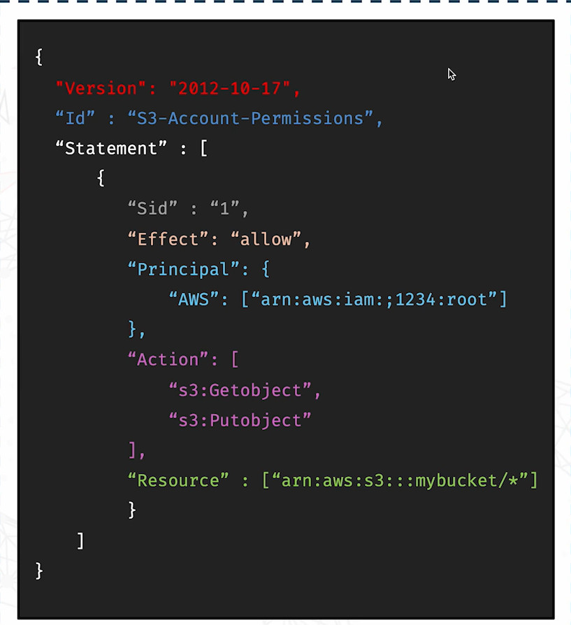

# DevOps-Learning-AWS
Repository containing topics I learnt in the CoderCo AWS Module.

## AWS Global Infrastructure

### AWS Regions
Physical locations around the world where AWS has multiple data centres, ensuring resiliency and high availability. If one data centre fails, AWS quickly sqitches over to another data centre. They are the backbone of AWS. To choose a region, you would need to consider a few things such as latency, pricing, compliance and services. Each region has its own unique identifier. Most AWS services are region scoped. 

### AWS Availability Zones
Each region is made up of multiple AZs, usually 3. Separate from each other, isolated from disasters. Connected with high bandwidth, ultra-low latency networking. Each AZ is one or more discrete data centre with redundant power, networking and connectivity.

### Points of Presence (Edge Locations)
Roughly 400 points of presence. Content is delivered to end users with lower latency. Helpful for applications which require speed of delivery such as video streaming and gaming. 

## AWS IAM
IAM allows you to create users, groups and policies which lets you manage access to AWS resources. Groups makes it easier to grant permissions to a group of users with the same job role. Policies are used to define what a user or group can and cannot do on AWS. You can also allow temporary access through IAM roles. 

### IAM Users and Groups
- Root account: Created on AWS account creation. Has full access to everything on the account (very dangerous!). This should never be shared or used for day to day tasks. 
- Users: Individual people or services that need access to AWS. Each user gets their own login and are then given permissions. 
- Groups: A team of users which can be assigned permissions as a group. Does not contain other groups. Users do not have to belong to a group and users can belong to multiple groups. 

### IAM Permissions
Users and groups in AWS are assigned policies which are json documents which define what they are and aren't allowed to do. In AWS, always apply rhe least privilege principle (don't give more access than a user needs).

### IAM Policies Inheritance
How permissions are passed down to users and groups. Users inherit permissions which are assigned to their groups. E.g. if Charles is part of both the developer group and the DevOps group, he would inherit the permissions of both groups. Users can also have inline policies attached which are policies that are given to a user directly rather than through a group. 

### IAM Policies Structure
- Version: Policy language version, always include "2012-10-17".
- Id: An identifier for the policy (optional).
- Statement: One or more individual statements (required). This consists of:
    - Sid: An identifier for the statement (optional).
    - Effect: Where the statement allows or denies access (Allow, Deny).
    - Principal: Account/user/role to which this policy is applied to.
    - Action: List of actions this policy allows or denies.
    - Resource: List of resources to which the actions apply to.
    - Condition: Conditions for when this policy is in effect (optional).

An example can be seen below;

### IAM Password Policy
AWS allows you to set up a password policy to make sure every user is using strong, secure passwords. This includes a minimum password length, specific types of characters (uppercase letters, lowercase letters, numbers and non-alphanumeric characters), allow all IAM users to change their own passwords, enforce a password expiry policy and prevent password re-use. 

### Multi-Factor Authentications
Requires you to know the password as well as have the device which contains the MFA one-time code. Secures your account. RECOMMENDED!

MFA Devices includes:
- Virtual MFA: Application on your phone or device which generates a one time code (Google authenticator, Authy etc).
- Universal 2nd Factor (U2F) Security Key: A physical device you plug into your PC and authenticates your login without a code. Supports multiple users including the root user.
- Hardware Key Fob MFA Device: Physical devices which generate a new code every 30 seconds or so. 
- Hardware Key Fob MFA Device for AWS GovCloud (US): Specifically for AWS users in the GovCloud in the US. Similar to the above.

### User Access on AWS
- There are three options to access AWS:
    - AWS Management Console (protected by password and MFA)
    - AWS CLI (Protected by access keys)
    - AWS SDK (Protected by access keys)

- Access keys are generated through the AWS console.
- Users manage their own access keys.
- Access keys are secret, just like passwords. Don't share them!
- Access Key ID ~= username
- Secret Access Key ~= password

### AWS CLI
A super powerful tool that lets you interact with AWS services right from your command line. No need to login to your management console, every time you need to do something. You get direct access to the public API for AWS services. Great for developing scripts to manage resources. Open-source!

### AWS SDK
Super handy tool which lets you interact with AWS from your code. Language specific APIs. Lets you embed AWS services directly into your application. 

### IAM Roles for Services
Some AWS services will need to perform actions on your behalf. For this, we would need to grant them permissions using IAM roles. E.g. EC2 instance roles, Lambda Function roles, Roles for CloudFormation. This prevents us from hardcoding credentials into services. 

### IAM Security Tools
- IAM Credential Reports (Account level): A report that lists all your accounts users and the status of their various credentials.
- IAM Access Advisor (User level): Shows the service permissions granted to users and when those services were last accessed. Can be used to revise policies.

### IAM Guidelines and Best Practices
- Don't use the root account except when AWS account setup
- One physical user = One AWS user
- Assign users to groups and asign permissions to groups
- Create strong password policies
- Use and enforce the use of MFA
- Create and use Roles for giving permissions to AWS services
- Use access keys for programmatic access
- Audit permissions of your account using IAM Credential Reports and IAM Access Advisor
- Never share IAM USers and Access Keys